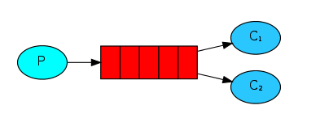
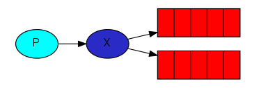
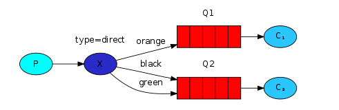
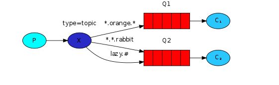
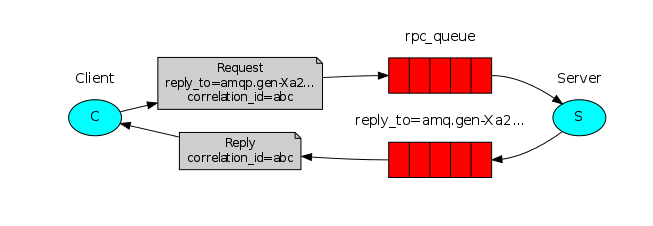

Go-rabbitmq-tutorial

### 简介

RabbitMQ 是一个实现了高级消息队列协议（AMQP）的开源消息代理中间件。 俗称消息队列


### 基本组件

* Connection 连接. 使用MQ之前需要建立连接

* Producer 生产者
* Consumer 消费者
* Broker 服务器实例 管理消息和队列
* Message 消息 由消息头和消息体组成
* Queue 队列。消息的存放容器，先进先出
* Exchange 交换器。 分发消息，将消息路由给服务器中的队列
* Channel 信道
* Virtual Host 虚拟主机


### 博客
<a href="blog.caixiaoxin.cn/?p=712" target="_blank">博客</a>

### 官网

<a href="rabbitmq.com" target="_blank">Rabbitmq官网</a>


### AMQP客户端

<a href="https://github.com/rabbitmq/amqp091-go" target="_blank">The Go RabbitMQ client library </a>


### 安装

```vim
docker run -it --rm --name go-rabbitmq-tutorial -p 5672:5672 -p 15672:15672 rabbitmq:3.10-management

guest/guest
```


### 简单模式

一个生产者，一个队列，一个消费者。Exchange不参与


```shell
cd hello-world

# shell1
go run send.go

# shell2
go run receive.go
```


### 工作模式

Work Queue 工作队列。处理一些不需要立即执行，比较耗时的一些任务

Work Queue 会将消息分发给不同的消费者进行处理（消费者接受到的消息是不同的），消费者接受消息的数量取决于自身处理消息的速度，可以不有效的提升性能

场景： 短信、邮件等提醒



```shell
cd worker-queue

# shell1
go run worker.go

# shell2
go run new_task.go

# 或者 开多个终端

# shell1
go run worker.go

# shell2
go run worker.go

#shell3
go run new_task.go
```


### 发布订阅

Publist/Subscribe 发布订阅

生产者产生一条消息，将消息发送给交换器，交换器将消息推送给所有的消费者。消费者接受到的消息是相同的。

场景： 开放平台  开发者订阅了某个开放平台的api之后，数据有变化就会自动获取到最新的数据




```shell
cd publish-subscribe

# shell1
# 如果你想保存日志文件
go run receive_log.go > logs_from_rabbit.log

# 如果你想再终端看到日志
go run receive_log.go

# shell2
go run emit_log.go


```


### 路由模式

Routing

其实就是发布订阅模式的升级版。将不同消息通过路由key进行绑定，进入不同的队列，每个队列的处理不同的业务逻辑

场景： 日志系统  重要的日志，有专门的队列消费处理



```shell
cd publish-subscribe

# shell1
# 如果你想保存日志文件
go run receive_logs_direct.go warning error > logs_from_rabbit.log

# 如果你想再终端看到日志
go run receive_logs_direct.go info warning error

# shell2
go run emit_log_direct.go error "Run. Run. Or it will explode."
```


### 主题订阅模式

Topics

在路由模式的基础上增加了通配符。可以惊醒Routing ket的模糊匹配，使得消息的分发更加灵活

但是模糊匹配相对于路由模式来讲，效率可能比较低，实际中尽量采用路由模式

通配符 ‘*’ ‘#’ *: 单个关键字 #: 多个关键字



 ```shell
cd topics
# shell1
go run receive_logs_topic.go "#"

# shell2
go run receive_logs_topic.go "kern.*"

# shell3
go run receive_logs_topic.go "*.critical"

# shell4
go run receive_logs_topic.go "kern.*" "*.critical"

# shell5
go run emit_log_topic.go "kern.critical" "A critical kernel error"

 ```


### RPC同步通信

MQ是一个异步通信的，也就是生产者发送消息之后，是不知道消费者的处理结果的（成功、失败、甚至都不知道消费者有没有处理这条消息）。

有些时候，在开发中，生产者是需要知道消费者的处理结果，然后再进行下一步任务的处理。也就是同步调用。相当于RPC（Remote Procedure Call 远程过程调用）

如下图所示，实际上有两个队列，client产生了消息之后，将消息放入队列，server端开始进行消费，消费后的结果也放入一个队列，被client处理. 整个过程，是一个线程阻塞的状态。影响性能，适用于特殊的业务场景需求。



```shell
cd rpc

# shell1
go run rpc_server.go

# shell2
go run rpc_client.go 40
```

